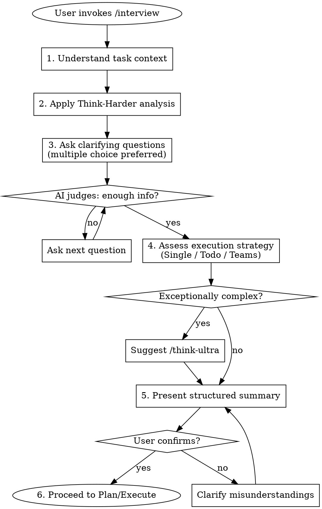

# Interview Mode

## Overview

A task-oriented clarification interview that helps AI deeply understand user requirements before planning or execution. Unlike brainstorming (for exploring vague ideas), interview mode is for **clarifying concrete tasks** the user wants accomplished.

**Built-in Think-Harder**: This mode automatically applies systematic analytical thinking to understand requirements deeply. For exceptionally complex problems with philosophical or multi-paradigm dimensions, suggest `/think-ultra`.

## When to Use

- User has a **concrete task** but details are unclear
- AI needs to understand context, constraints, or success criteria
- Before entering plan mode for complex implementations
- When task scope or requirements need clarification

## When NOT to Use

- User has a vague idea needing exploration → Use `/brainstorm` instead
- Task is simple and self-explanatory → Execute directly
- User explicitly provides complete requirements

## Interview Process



## Think-Harder Analysis (Built-in)

Apply this analytical framework **automatically** during the interview:

### 1. Problem Clarification
- Define the core question and identify implicit assumptions
- Establish scope, constraints, and success criteria
- Surface potential ambiguities and multiple interpretations

### 2. Multi-Dimensional Analysis
- **Structural decomposition**: Break into fundamental components
- **Stakeholder perspectives**: Consider viewpoints of all affected parties
- **Temporal analysis**: Short-term vs. long-term implications
- **Causal reasoning**: Map cause-effect relationships

### 3. Critical Evaluation
- Challenge initial assumptions and identify cognitive biases
- Generate alternative approaches
- Consider trade-offs for each option

### 4. Synthesis
- Connect insights across different aspects
- Identify emergent properties from component interactions
- Develop actionable understanding

### 5. Execution Topology Assessment

Evaluate the task's execution characteristics to recommend the optimal strategy:

| Dimension | Single Session | Task Todo | Agent Teams |
|-----------|---------------|-----------|-------------|
| **Parallelizability** | N/A (1-2 steps) | Low — sequential steps | High — independent sub-tasks |
| **File Overlap** | N/A | High — same files touched | Low — separate file trees |
| **Step Count** | 1-2 steps | 3+ steps | 3+ parallel tracks |
| **Dependency Chain** | Linear | Sequential chain | Branching / fan-out |
| **Exploration Need** | Minimal | Moderate | High — multi-perspective |
| **Cost Justification** | Low overhead | Moderate overhead | Worth coordination cost |

**Decision Tree**:
```
Simple (1-2 steps)?
  → Single Session

3+ steps?
  → All sequential or same files?
      → Task Todo
  → Parallel + separate files?
      → Needs multi-perspective exploration?
          → Agent Teams
      → Simple parallel?
          → Task Todo
```

**Agent Teams Sweet Spots** (recommend when 2+ apply):
- Research/review from multiple angles simultaneously
- New modules with separate file trees (e.g., frontend + backend + tests)
- Debugging with competing hypotheses tested in parallel
- Cross-layer changes that don't share files

**Agent Teams Anti-Patterns** (avoid when any apply):
- Sequential dependency chains (step N depends on step N-1)
- Heavy same-file editing (merge conflicts)
- Routine/boilerplate tasks (overhead > benefit)
- Simple tasks where coordination cost exceeds time saved

**When to escalate to /think-ultra**:
- Problem has ontological or epistemological dimensions
- Requires cross-disciplinary integration (science + philosophy + economics)
- Involves game theory or complex strategic interactions
- Needs scenario planning with black swan analysis

## Questioning Strategy

### Depth Levels (Adaptive)

| Level | When to Use | Example Questions |
|-------|-------------|-------------------|
| **Surface** | Technical choices | "React or Vue?" "Need backend?" |
| **Requirements** | Goals & constraints | "What problem does this solve?" "Who uses it?" |
| **Deep** | Complex tasks (built-in think-harder) | "Why this approach?" "Hidden assumptions?" |
| **Ultra** | Exceptionally complex → suggest `/think-ultra` | Philosophical, multi-paradigm problems |

### Question Style

**Prefer multiple choice** (fits AskUserQuestion tool):
```
Which authentication method do you prefer?
A. JWT tokens (stateless, scalable)
B. Session-based (simpler, server-side state)
C. OAuth only (third-party providers)
D. Other
```

**Use open-ended for**:
- Motivations and goals
- Context that needs elaboration
- When options are unclear

### One Question at a Time

- Ask **one focused question** per turn
- Wait for response before next question
- Group related sub-questions only if tightly coupled

## Output: Requirements Summary

When AI judges sufficient understanding, produce this structured summary:

```markdown
## Requirements Summary

### Goal
[What the user wants to achieve - 1-2 sentences]

### Context
[Relevant background, existing systems, constraints]

### Scope
- **In scope**: [What will be done]
- **Out of scope**: [What won't be done]

### Success Criteria
- [ ] [Measurable outcome 1]
- [ ] [Measurable outcome 2]

### Technical Decisions
- [Decision 1]: [Choice made]
- [Decision 2]: [Choice made]

### Key Insights (from Think-Harder analysis)
- [Insight 1]: [Discovery from analytical process]
- [Insight 2]: [Hidden assumption uncovered]

### Execution Strategy
- **Recommended**: [Single Session | Task Todo | Agent Teams]
- **Rationale**: [1-2 sentences explaining why this strategy fits]
- **If Task Todo**: Estimated steps, key phases
- **If Agent Teams**: Suggested team size, teammate roles, parallelization points

### Open Questions (if any)
- [Questions to resolve during planning]
```

## Transition to Next Phase

After user confirms the summary, recommend along **two orthogonal dimensions**:

### Thinking Depth

1. **Ready to execute** → Proceed directly
2. **Needs planning** → Enter plan mode or use `/write-plan`
3. **Needs design** → Suggest `/brainstorm` for technical exploration
4. **Exceptionally complex** → Suggest `/think-ultra` before planning

### Execution Strategy

| Strategy | When | How |
|----------|------|-----|
| **Single Session** | Simple, 1-2 steps, sequential | Proceed normally in current session |
| **Task Todo** | 3+ sequential steps, dependency chains, same-file edits | Use `TaskCreate` for structured tracking |
| **Agent Teams** | Parallel sub-tasks, separate file trees, multi-perspective needs | Use `TeamCreate` with defined teammate roles |

### Recommended Pairings

| Scenario | Thinking Depth | Execution Strategy |
|----------|---------------|-------------------|
| Quick bug fix | Ready to execute | Single Session |
| Add a small feature | Needs planning | Single Session |
| Multi-step refactoring | Needs planning | Task Todo |
| Large feature, independent modules | Needs planning | Agent Teams |
| Architecture redesign | Needs design | Task Todo |
| Cross-layer feature (frontend + backend + tests) | Needs planning | Agent Teams |
| Novel algorithmic problem | Exceptionally complex | Single Session |
| Full-stack app from scratch | Needs design | Agent Teams |

### Presenting the Recommendation

After the user confirms the requirements summary, present the recommendation like this:

```markdown
Based on the requirements, I recommend:

- **Thinking Depth**: [depth] — [1 sentence why]
- **Execution Strategy**: [strategy] — [1 sentence why]

[If Task Todo]: I'll create a structured task list with ~N steps covering [key phases].
[If Agent Teams]: I suggest a team of N agents:
  - **[Role 1]**: [responsibility]
  - **[Role 2]**: [responsibility]
  - Parallelization: [what runs concurrently]

Shall I proceed with this approach?
```

## Example Interview Flow

**User**: `/interview` 帮我给这个项目加个用户认证功能

**AI**: 我来帮你澄清认证功能的需求。

*(Applying Think-Harder: 分析问题结构，识别隐含假设...)*

第一个问题：这个认证功能主要面向什么用户群体？

| 选项 | 描述 |
|------|------|
| A. 内部团队 | 公司员工使用，可信任环境 |
| B. 公开用户 | 互联网用户注册使用 |
| C. 企业客户 | B2B 场景，需要组织管理 |
| D. 其他 | 请说明 |

**User**: B，公开用户

**AI**: 明白。

*(Think-Harder: 公开用户意味着需要考虑安全性、滥用防护、隐私合规...)*

第二个问题：需要支持哪些登录方式？

| 选项 | 描述 |
|------|------|
| A. 邮箱密码 | 传统注册登录 |
| B. 社交登录 | Google/GitHub 等第三方 |
| C. 两者都要 | 邮箱 + 社交登录 |
| D. 其他 | 手机号、SSO 等 |

*(Interview continues until AI has enough understanding...)*

**AI**: 我已经理解了你的需求，让我总结一下：

## Requirements Summary

### Goal
为公开用户添加认证功能，支持邮箱和 Google 社交登录

### Scope
- **In scope**: 注册、登录、密码重置、JWT token
- **Out of scope**: 权限管理、用户画像

### Success Criteria
- [ ] 用户可以邮箱注册并登录
- [ ] 用户可以用 Google 账号登录
- [ ] Token 安全存储和自动刷新

### Key Insights
- 公开用户场景需要考虑 rate limiting 防止暴力破解
- 社交登录简化注册流程但增加第三方依赖

### Execution Strategy
- **Recommended**: Task Todo
- **Rationale**: 4+ sequential steps with dependencies (数据库 schema → 后端 API → 前端页面 → 测试), same-file edits likely in auth middleware and user model
- **Estimated steps**: 5 steps — (1) 数据库 schema 和 User model, (2) 邮箱注册/登录 API, (3) Google OAuth 集成, (4) 前端登录页面, (5) 测试和安全加固

这个理解准确吗？确认后我们进入 plan 阶段。

Based on the requirements, I recommend:

- **Thinking Depth**: Needs planning — 认证功能涉及多个模块和安全考量，需要先制定详细计划
- **Execution Strategy**: Task Todo — 4+ sequential steps with dependencies, same-file edits likely

I'll create a structured task list with 5 steps covering: database schema, backend APIs, OAuth integration, frontend, and testing.

Shall I proceed with this approach?

## Key Principles

1. **Task-oriented**: Focus on what needs to be done, not exploring ideas
2. **Think-Harder by default**: Apply systematic analysis automatically
3. **Adaptive depth**: Escalate to /think-ultra only for exceptional complexity
4. **Efficient**: Get necessary info without over-questioning
5. **Clear output**: Produce actionable requirements summary with insights
6. **User control**: User confirms understanding before proceeding
