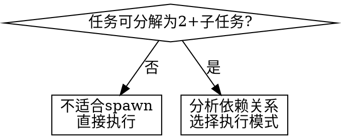
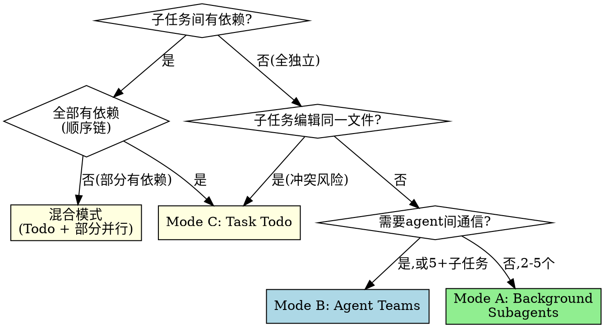

# Spawn — 任务执行拓扑路由器

## Overview

`/spawn` 是执行模式的**路由器**，不是执行器。分析任务特征 → 选择最优拓扑 → 确认 → 派发。

**核心原则**: 先分解，再路由，最后执行。永远不要在主线程串行做可以并行的事。

## When to Use



**适用场景**:
- 2+ 独立子任务（代码修改、调研、测试修复）
- 多文件/多模块并行修改
- 需要多角度探索的复杂问题
- 有明确步骤链的多阶段任务

**不适用**:
- 单一任务，无法分解
- 子任务强耦合（编辑同一函数的不同部分）
- 快速修复（< 3 分钟）

## 三种执行模式

| 特征 | A: Background Subagents | B: Agent Teams | C: Task Todo |
|------|------------------------|----------------|-------------|
| **适用** | 2-5 个独立任务 | 需要协调的多 agent | 有依赖链的步骤 |
| **并行度** | 全并行 | 协调式并行 | 串行/部分并行 |
| **通信** | 无（fire-and-forget） | 共享 task list + 消息 | 主线程追踪 |
| **工具** | `Agent(run_in_background=true)` | `TeamCreate` + `Agent(team_name=)` | `TaskCreate` + `TaskUpdate` |
| **文件冲突** | 需确保无重叠 | 用 worktree 隔离 | 天然安全 |
| **典型场景** | 修3个独立bug、并行调研 | 前后端同时开发 | 实现计划的步骤链 |

## 模式选择决策树



**额外考虑**:
- **探索需求强** → 偏向 Mode B（共享发现）
- **用户想控制进度** → 偏向 Mode A（background + 主线程讨论）
- **步骤间输出是下一步输入** → 必须 Mode C

## The Process

1. **分解**: 将任务拆解为子任务，标注依赖关系和文件范围
2. **路由**: 根据决策树选择模式，向用户展示：
   - 子任务列表（编号）
   - 推荐模式 + 理由
   - 各子任务的 agent 类型（general-purpose / Explore / Plan 等）
3. **确认**: 用 `AskUserQuestion` 让用户确认或调整
4. **派发**: 按选定模式执行

## Dispatch Prompt 结构

每个子 agent 的 prompt 必须包含：

```markdown
## 任务
[具体任务描述，1-3 句]

## 上下文
- 项目: [路径/技术栈]
- 相关文件: [列出关键文件]
- 约束: [不要修改的文件/范围限制]

## 期望输出
[明确的交付物描述]

## 与其他子任务的关系
[如有依赖，说明等待/产出关系]
```

**关键**: Prompt 要自包含。不要假设 agent 能看到主线程上下文。

### Mode A 派发示例

```
# 并行派发 3 个 background agent
Agent(description="修复登录bug", subagent_type="general-purpose",
      run_in_background=true, prompt="...")
Agent(description="修复支付bug", subagent_type="general-purpose",
      run_in_background=true, prompt="...")
Agent(description="调研缓存方案", subagent_type="Explore",
      run_in_background=true, prompt="...")
```

### Mode B 派发示例

```
# 创建团队
TeamCreate(team_name="feature-auth")

# 创建任务
TaskCreate(subject="实现后端API", ...)
TaskCreate(subject="实现前端组件", ...)

# 派发队友
Agent(name="backend-dev", team_name="feature-auth",
      subagent_type="general-purpose", prompt="...")
Agent(name="frontend-dev", team_name="feature-auth",
      subagent_type="general-purpose", prompt="...")
```

### Mode C 派发示例

```
# 主线程创建 Todo 追踪
TaskCreate(subject="Step 1: 设计数据库schema", ...)
TaskCreate(subject="Step 2: 实现API层", ...)  # blockedBy: Step 1
TaskCreate(subject="Step 3: 写集成测试", ...)  # blockedBy: Step 2

# 按序执行，每步用 subagent
TaskUpdate(taskId="1", status="in_progress")
Agent(description="设计schema", subagent_type="general-purpose", prompt="...")
TaskUpdate(taskId="1", status="completed")
```

## Common Mistakes

| 错误 | 正确做法 |
|------|---------|
| 不分析直接并行 | 先检查文件重叠和依赖 |
| Agent prompt 太模糊 | 包含具体文件路径、错误信息、期望输出 |
| 忘记整合结果 | Mode A 完成后必须 review 所有变更 |
| 所有任务都用 Team | 简单并行用 Background，不需要 Team 的开销 |
| 跳过用户确认 | 派发前必须展示分解方案并确认 |
| Agent 间编辑同一文件 | 有重叠时降级为 Task Todo 或用 worktree 隔离 |

## Integration

- **`dispatching-parallel-agents`**: Mode A 的执行参考
- **`subagent-driven-development`**: Mode C 带 review 的增强版
- **`writing-plans`**: 复杂任务先用此 skill 产出计划，再用 `/spawn` 派发
- **`interview-mode`**: 任务不明确时，先 `/interview` 澄清需求，再 `/spawn`
