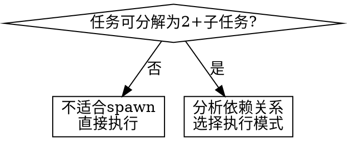
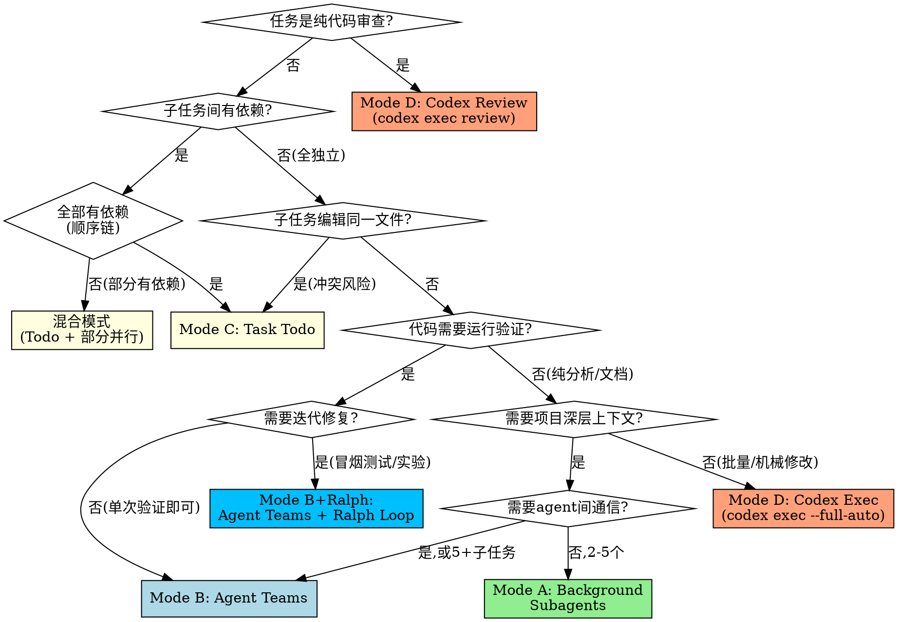

# Spawn — 任务执行拓扑路由器

## Overview

`/spawn` 是执行模式的**路由器**，不是执行器。分析任务特征 → 选择最优拓扑 → 确认 → 派发。

**核心原则**: 先分解，再路由，最后执行。永远不要在主线程串行做可以并行的事。

## When to Use



**适用场景**:
- 2+ 独立子任务（代码修改、调研、测试修复）
- 多文件/多模块并行修改
- 需要多角度探索的复杂问题
- 有明确步骤链的多阶段任务
- 代码审查或批量机械修改（委派给 Codex）

**不适用**:
- 单一任务，无法分解
- 子任务强耦合（编辑同一函数的不同部分）
- 快速修复（< 3 分钟）

## 四种执行模式

| 特征 | A: Background Subagents | B: Agent Teams | C: Task Todo | D: Codex 外部委派 |
|------|------------------------|----------------|-------------|-------------------|
| **适用** | 2-5 个独立任务 | 需要协调的多 agent | 有依赖链的步骤 | 代码审查、批量修改 |
| **并行度** | 全并行 | 协调式并行 | 串行/部分并行 | 单任务委派 |
| **通信** | 无（fire-and-forget） | 共享 task list + 消息 | 主线程追踪 | 无（外部 CLI） |
| **执行者** | Claude subagent | Claude subagent | Claude 主线程 | OpenAI GPT (codex) |
| **工具** | `Agent(run_in_background=true)` | `TeamCreate` + `Agent(team_name=)` | `TaskCreate` + `TaskUpdate` | `Bash(codex exec ...)` |
| **文件冲突** | 需确保无重叠 | 用 worktree 隔离 | 天然安全 | 天然安全（单任务） |
| **典型场景** | 修3个独立bug、并行调研 | 前后端同时开发 | 实现计划的步骤链 | review 分支、批量重命名 |

## 模式选择决策树



**"运行验证"判断标准**: 代码修改后需要 `python3 xx.py`、跑测试、冒烟测试、执行实验来确认正确性。只要答案是"是"，就不能用 Mode A — subagent 通过 `Agent()` 单次调用，执行完即退出，没有 hooks 也没有 session 持久化，所以无法做"跑一下 → 看报错 → 改 → 再跑"的循环。而 Agent Teams 的 teammate 是完整的 Claude Code session，拥有 hooks、shared task list 和消息机制，天然支持迭代验证。

**混合任务路由**: 当同一个 `/spawn` 中的子任务需要不同模式时（比如 1,2 是纯分析适合 Mode A，3,4 是改代码需要验证适合 Mode B），按以下策略处理：
- **统一提升**: 如果大部分子任务需要 Mode B，全部用 Mode B（teammate 做纯分析也没问题，只是开销稍大）
- **分批派发**: 如果模式差异大（比如 2 个纯分析 + 2 个迭代实验），拆成两批：纯分析用 Mode A 并行，代码验证用 Mode B 团队
- **判断原则**: 避免为了省开销把需要验证的任务降级到 Mode A

**额外考虑**:
- **代码修改+需要验证** → 必须 Mode B（teammate 有完整 session 生命周期，可以 write→test→fix）
- **迭代型验证（冒烟测试/实验循环）** → Mode B + Ralph Loop（teammate 自动迭代直到通过）
- **探索需求强** → 偏向 Mode B（共享发现）
- **纯分析/调研/文档** → Mode A 足够（不涉及代码验证）
- **步骤间输出是下一步输入** → 必须 Mode C
- **纯审查/批量机械修改** → 偏向 Mode D（Codex，释放 Claude context）

## The Process

1. **分解**: 将任务拆解为子任务，标注依赖关系和文件范围
2. **路由**: 根据决策树选择模式，向用户展示：
   - 子任务列表（编号）
   - 推荐模式 + 理由
   - 各子任务的 agent 类型（general-purpose / Explore / Plan 等）
3. **确认**: 用 `AskUserQuestion` 让用户确认或调整
4. **派发**: 按选定模式执行

## Dispatch Prompt 结构

每个子 agent 的 prompt 必须包含：

```markdown
## 任务
[具体任务描述，1-3 句]

## 上下文
- 项目: [路径/技术栈]
- 相关文件: [列出关键文件]
- 约束: [不要修改的文件/范围限制]

## 期望输出
[明确的交付物描述]

## 与其他子任务的关系
[如有依赖，说明等待/产出关系]
```

**关键**: Prompt 要自包含。不要假设 agent 能看到主线程上下文。

### Mode A 派发示例

```
# 并行派发 3 个 background agent
Agent(description="修复登录bug", subagent_type="general-purpose",
      run_in_background=true, prompt="...")
Agent(description="修复支付bug", subagent_type="general-purpose",
      run_in_background=true, prompt="...")
Agent(description="调研缓存方案", subagent_type="Explore",
      run_in_background=true, prompt="...")
```

### Mode B 派发示例

```
# 创建团队
TeamCreate(team_name="feature-auth")

# 创建任务
TaskCreate(subject="实现后端API", ...)
TaskCreate(subject="实现前端组件", ...)

# 派发队友
Agent(name="backend-dev", team_name="feature-auth",
      subagent_type="general-purpose", prompt="...")
Agent(name="frontend-dev", team_name="feature-auth",
      subagent_type="general-purpose", prompt="...")
```

### Mode B + Ralph Loop 派发示例（迭代型验证）

适用于冒烟测试、实验执行等需要 write→test→fix 循环的任务。

注意：teammate 是完整 Claude Code session，可以使用 `/ralph-loop` slash command（因为它有 Stop hook 支持）。但 Mode A 的 background subagent 通过 `Agent()` 单次调用，没有 hook 机制，无法运行 Ralph Loop。

```
# 创建团队
TeamCreate(team_name="eval-team")

# Teammate 使用 Ralph Loop 自己迭代直到通过
# teammate 拥有完整 session，支持 hooks 和 slash commands
Agent(name="experiment-runner", team_name="eval-team",
      subagent_type="general-purpose",
      prompt="运行冒烟测试: python3 scripts/smoke_test.py
      遇到报错自行修复代码并重新运行。
      使用 /ralph-loop '修复报错并重跑测试' --completion-promise 'ALL PASS' --max-iterations 10
      Output <promise>ALL PASS</promise> when all tests pass.")

# Lead 不改代码，只协调和汇报
```

### Mode B + Codex 交叉 Review（质量验证）

Teammate 完成代码修改后，用 Codex（不同 model）交叉检查，发现 teammate 的盲点。

```
# 1. Teammate 完成修改后，lead 调用 Codex review
codex exec review --uncommitted "Review the changes made by teammate,
  focus on: correctness, regressions, edge cases, import errors"

# 2. 如果 Codex 发现问题，lead 派发 teammate 修复（而非自己改）
SendMessage(to="backend-dev", message="Codex review 发现以下问题: ..., 请修复")
```

**组合工作流**: 对于重要的代码修改，推荐 Mode B → teammate 完成 → Codex review → teammate 修复 → 合并。

### Mode C 派发示例

```
# 主线程创建 Todo 追踪
TaskCreate(subject="Step 1: 设计数据库schema", ...)
TaskCreate(subject="Step 2: 实现API层", ...)  # blockedBy: Step 1
TaskCreate(subject="Step 3: 写集成测试", ...)  # blockedBy: Step 2

# 按序执行，每步用 subagent
TaskUpdate(taskId="1", status="in_progress")
Agent(description="设计schema", subagent_type="general-purpose", prompt="...")
TaskUpdate(taskId="1", status="completed")
```

### Mode D 派发示例

```bash
# 审查当前分支（使用 codex-review skill）
codex exec review --base main "Focus on correctness, regressions, edge cases"

# 审查未提交变更
codex exec review --uncommitted

# 批量机械修改（使用 codex-skill）
codex exec --full-auto "rename all instances of oldAPI to newAPI across src/"
```

**Mode D 适用判断**: 任务不需要理解项目架构、不需要多轮讨论、输入输出明确。典型：代码审查、批量重命名、格式化、简单 migration。

## 主线程行为规则

**核心原则**: 主线程是协调者，不是执行者。派发后不要在主线程写代码。

| 事件 | 主线程应该做 | 主线程不应该做 |
|------|-------------|---------------|
| Agent 报告完成 | 整合结果，汇报用户 | — |
| Agent 报告错误 | 分析原因，向用户展示选项 | 自己动手改代码修复 |
| 需要修复代码 | 派发新 agent/teammate 去修 | 在主线程上下文中修改 |
| 用户主动要求修改 | 可以在主线程修改 | — |
| 所有 agent 完成 | 可调用 Codex 交叉 review | 假设代码没问题直接提交 |

**为什么**: Subagent 报错返回主线程 → 主线程看到报错 → 主线程"帮忙"改代码 → 上下文被代码修改污染。这是 Mode A 最常见的问题。解法：要么用 Mode B（错误隔离在 teammate 内），要么主线程严格不改代码。

## 路由案例参考

以下真实案例展示不同任务应该如何路由：

| 用户输入 | 正确路由 | 理由 |
|----------|---------|------|
| `1.错题分析 2.工具调用分析 3.时间分析 4.insight建议` | **Mode A** | 全是纯分析读取，无代码修改，无需验证 |
| `1.框架改进 2.执行实验D 3.扩大评测 4.流式评测 5.适配新benchmark` | **Mode B** | 1,5 改代码需验证; 2,3,4 跑实验可能报错需迭代 |
| `确保框架能运行，冒烟测试所有模式` | **Mode B + Ralph Loop** | 冒烟测试=验证，失败需 write→fix→retest 循环 |
| `review PR #42 的安全性和性能` | **Mode D (Codex)** | 纯代码审查，不修改代码 |
| `1.设计schema 2.实现API(依赖1) 3.写测试(依赖2)` | **Mode C** | 全链式依赖，必须串行 |

**快速判断**: 如果子任务描述中出现"运行"、"测试"、"验证"、"实验"、"冒烟"、"确保能跑"等词，大概率需要 Mode B。

## Common Mistakes

| 错误 | 正确做法 |
|------|---------|
| 不分析直接并行 | 先检查文件重叠和依赖 |
| Agent prompt 太模糊 | 包含具体文件路径、错误信息、期望输出 |
| 忘记整合结果 | Mode A 完成后必须 review 所有变更 |
| 所有任务都用 Team | 简单并行用 Background，不需要 Team 的开销 |
| 跳过用户确认 | 派发前必须展示分解方案并确认 |
| Agent 间编辑同一文件 | 有重叠时降级为 Task Todo 或用 worktree 隔离 |
| 复杂任务用 Codex | Codex 适合机械/审查任务，复杂逻辑用 Claude subagent |
| **用 Mode A 做需要验证的代码修改** | **代码改完需要跑一下验证的，必须用 Mode B（teammate 有完整生命周期）** |
| **Subagent 报错后主线程自己改代码** | **主线程不改代码，派发新 agent/teammate 去修，或报告用户** |
| **代码修改后不做交叉 review** | **重要修改完成后用 Codex review 交叉验证** |

## Integration

- **`dispatching-parallel-agents`**: Mode A 的执行参考
- **`subagent-driven-development`**: Mode C 带 review 的增强版
- **`codex-review`**: Mode D 审查路径的详细 skill（命令格式、输出结构、review 优先级）
- **`codex-skill`**: Mode D 实现路径的详细 skill（沙箱模式、模型选择）
- **`writing-plans`**: 复杂任务先用此 skill 产出计划，再用 `/spawn` 派发
- **`interview-mode`**: 任务不明确时，先 `/interview` 澄清需求，再 `/spawn`
